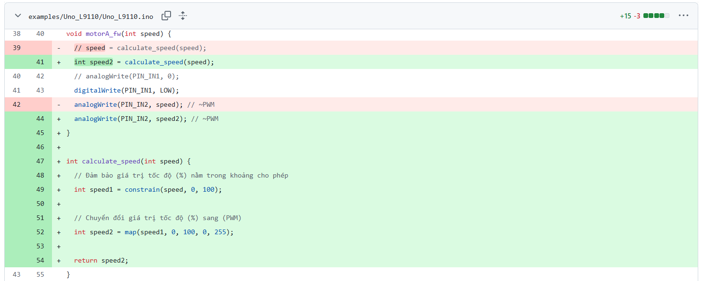

### 1_L9110_motorA_fw-100
Chương trình có thể đảo chiều động cơ, nhưng không thay đổi được tốc độ
### 2_L9110_Khongdung_Cal-speed
Tắt hết các function car_fw, cal_speed. Người dùng Nhập số liệu PWM 0-255 trực tiếp vào hàm motorX_fw()
### 3_L9110_Dung_Cal-speed_1
Thử dùng thêm các biến phụ: speed1, speed2

### 4_L9110_Dung_Cal-speed_2
Không dùng các biến phụ nữa, trả hàm cal_speed về mặc định
### 5_L9110_Dung_carfw_50_fail
Sử dụng tiếp hàm car_fw(50, 50) -> Chương trình bị lỗi không điều khiển được tốc độ
### 6_Loi-logic-ham-car_fw
Phân tích logic hàm car_fw và phát hiện bị dư lệnh cal_speed. Lệnh này đã dùng ở trong hàm motorA_fw() và motorB_fw()
### 7_Sua-loi-logic-ham-car_fw-thanh-cong
Tắt 2 lệnh cal_speed trong hàm car_fw và chương trình điều khiển tốc độ thành công
### 8_L9110-car_bw-thanh-cong
Kiểm tra thêm hàm car_bw(50, 50) thành công
### 9_Phan_tich_motor_bw__255-speed
Kiểm tra hàm car_bw(30, 30) thành công. Phân tích tại sao dùng phép tính 255-speed tại chiều quay ngược chiều kim đồng hồ.